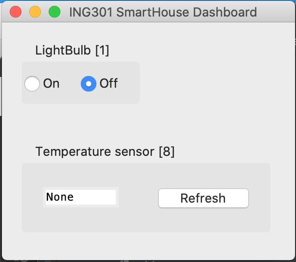

# ING301 prosjekt - Del D

I del D av prosjektet skal dere implementere klient-applikasjoner som bruker REST API for SmartHus sky-tjenesten som dere implementerte i Del C. Konkret skal det implementeres:

- en *dashboard applikasjon* som gjør det mulig å hente målinger fra sensorer og sette tilstanden
- et *smarthus applikasjon* som simulerer de fysisk sensorer og aktuatorer i smarthuset

Dashboardet og smarthus applikajsonen skal kommuniserere med hverandre ved å bruke endepunktene i REST API'et.

## Setup og startkode

Start-koden for prosjektet finnes i dette github repository: 

https://github.com/selabhvl/ing301-projectpartD-startcode.git

some dere kan bruke som mal (**Use as Template**) tilsvarende tidligere startkode for prosjektene. Startkoden inneholder klasser for devices og sensors samt konstruksjon av smarthus demo eksemplet. 

For smarthus skytjenesten (REST API'et) kan dere enten bruke egen løsnings fra Del C eller alternativ bruke løsningsforslaget for Del C av prosjektet som finnes her:

https://github.com/selabhvl/ing301-projectpartC-solution.git

Husk at skytjenesten skal kjøre for at de to klient-applikasjoner skal kunne kommunisere.

Som en forenkling av oppgaven ser vi kun på kontroll av to enheter fra demo smarthuset:

- Sensor: Temperatursensor med device identifikasjon 1
- Aktuator: Lyspære (LightBulb) med device identifikasjon 8.

Dere skal bruke [requests-biblioteket](https://requests.readthedocs.io/en/latest/) for å implementere bruk av REST API fra klient-applikasjonene.

## Dashboard klient-applikasjon
 
Start-koden for en dashboard applikasjonen med grensesnitt implementert ved bruk av [tkinter](https://docs.python.org/3/library/tkinter.html) finnes i filene `dashboard.py`, `dashboard_lightbulb.py`, samt `dashboard_temperaturesensor.py`. 

Dashboard-applikasjonen startes ved å kjøre Python-scriptet `dashboard.py` og grensesnittet ser ut som vist nedenfor:

Følgende skal implementeres:

- I filen `dashboard_lightbulb.py` skal dere implementere metoden `refresh_btn_cmd` som kalles når brukeren trykker på `Refresh`-knappen og som skal hente temperaturen fra sky-tjenesten for temperatursensor 1.

- I filen `dashboard_temperaturesensor.py` skal dere implementere metoden `lightbulb_cmd` som blir utført når brukeren velger `On` eller `Off` knappene.

I filen `messaging.py` finnes klassene `SensorMeasurement` og `ActuatorState` med metoder som kan brukes for å konstruere body/payload i de requests som skal sendes til sky-tjenesten. 

I eksempler fra forelesninger med REST web-tjenseter finnes der også eksempler på bruk av `requests`-modulet.

https://github.com/selabhvl/ing301public/tree/main/examples/12_restapi_webservices

## Smarthus klient-applikasjon

Start-koden for en smarthus applikasjonen som skal simulere de fysiske enheter i et smarthus finnes i filene `smarthouse.py`, `smarthouse_lightbulb.py`, samt `smarthouse_temperaturesensor.py`. 

Smarthus-applikasjonen startes ved å kjøre Python-scriptet `smarthus.py` Dette programmet skriver output i shell`en.

Følgende skal implementeres:

- I filen `smarthouse_lightbulb.py` skal dere i `Actuator`-klassen implementere metoden `client` som skal hente tilstand for aktuatoren fra sky-tjenesten med et passende antall sekunders intervall. Videre skal dere implementere `run`-metoden som skal start en ny tråd som kjører `simulator`-metoden og en tråd som kjører `client`-metoden.

- I filen `smarthouse_temperature.py` skal dere i `Sensor`-klassen implementere metoden `client` som skal levere temperaturen til sky-tjenesten med passende antall sekunders intervall. Videre skal dere implementere `run`-metoden som skal start en ny tråd som kjører `simulator`-metoden og en tråd som kjører `client`-metoden.

`Sensor` og `Actuator`-klassen følger den samme modellen ved å ha en `client`-metode som kjører i en tråd og ivaretar kommunikasjon med sky-tjenesten og en `simulator`-metode som kjører i en annen tråd og simulerer den fysisks enheten som ligger til grunn.

Denne tutorial inneholder en mer grunnleggende introduksjon til tråd-programmering:

https://superfastpython.com/threading-in-python/ 

og spesielt kan dere lese om hvordan en metode/funksjon kan kjøres i en egen tråd her:

https://superfastpython.com/threading-in-python/#Example_of_Running_a_Function_in_a_Thread

## Test av systemet

Test systemet ved å kjøre sky-tjenesten sammen med klient-applikasjonen:

- Sjekk at når tilstand for lyspæren endres i dashboard så endrer også tilstanden i smarthuset
- Sjekk at når temperature ender seg i smarthuset så endres også temperatur i dashboard ved trykk på Refresh-knappen.

## Levering av prosjekt

Følgende skal leveres

- Linke til github repository med implemetasjon av tjenesten
- Screen-shot som viser dashboard- og smarthusapplikasjonen

## Videre arbeid

Smarthus prosjketet kan utvikles videre i ulike retninger for de som måtte a lyst til dette

- integrere database-løsningen fra Del B inn i det totale systemet
- Sette opp eks. Arduino/Raspberry Pi enheter for å få faktiske fysiske sensorer og aktuatorer
- Generalisere dashboard slik det kan lese inn en konfigurasjon av enheter fra sky-tjenesten
- Utvikle protokoll for registering av nye enheter i smarthuset
- Digital tvilling som viser romslig plassering av enheter samt målinger og tilstander
- Legge til sikkerhet
- Sette sky-tjenesten i drift på Azure, AWS, GCP eller tilsvarende